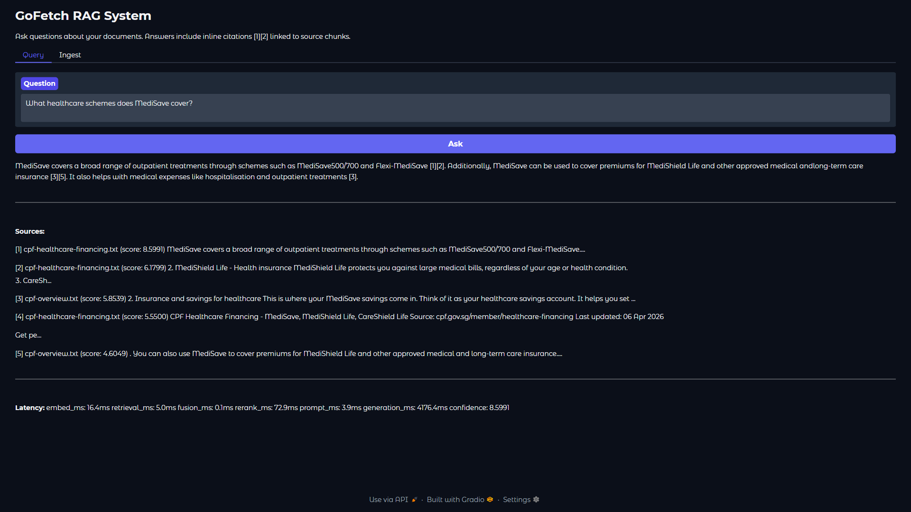

# GoFetch

RAG pipeline built from scratch with hybrid search, cross-encoder re-ranking, knowledge graph, and streaming answers with inline citations.



## Motivation

Before using LangChain or LlamaIndex I wanted to know what's actually happening inside a RAG system: how retrieval strategies compare, where re-ranking helps, and what it takes to keep an LLM grounded. This project is the result, a full pipeline from PDF ingestion to cited answers where every architecture choice is backed by an eval benchmark.

The corpus is a mix of Singapore government documents (CPF, HDB, MAS) and ML research papers, different enough in style to stress-test retrieval across formal policy text and technical prose.

## Architecture

```
Ingest:    PDF/text -> chunk (256 chars) -> embed -> pgvector + BM25 index + knowledge graph
                                                      |            |              |
Retrieve:  query -> parallel search --------> [dense] [sparse] [graph traversal]
                                                      |            |              |
                                                      +--- RRF fusion (k=60) ----+
                                                                   |
                                                      cross-encoder re-rank (top 5)
                                                                   |
Generate:  top chunks -> citation-aware prompt -> Gemini streaming -> [1][2] cited answer
```

### Hybrid search with RRF

BM25 and dense retrieval return scores on completely different scales. BM25 gives unbounded term-frequency scores (8.3, 12.7) while cosine similarity is bounded 0-1. You can't just average them. Reciprocal Rank Fusion sidesteps this by ignoring scores and working with ranks: `RRF(doc) = 1/(k + rank_bm25) + 1/(k + rank_dense)`. Documents that both retrievers agree on naturally rise to the top, without needing to normalize anything.

### Two-stage retrieval

A bi-encoder (sentence-transformers) embeds the query and chunks independently. It's fast because chunk embeddings are pre-computed, so retrieval is just an ANN lookup. But the query and document never attend to each other, so it misses nuance. A cross-encoder (ms-marco) processes query+chunk as a single input, which is much more accurate but O(n) per candidate so it can't run on the full corpus.

So both retrievers grab 20 candidates each, RRF fuses them down to 10, and the cross-encoder re-ranks those 10 to the final top 5. Cross-encoder accuracy at bi-encoder speed.

### Knowledge graph

Vector search finds chunks that sound similar to the query. But sometimes the relevant context uses different language. A question about "healthcare schemes" might miss a chunk discussing "long-term care insurance" because the wording doesn't overlap enough for cosine similarity. The knowledge graph connects entities through extracted relationships (eg. CPF -> funds -> CareShield Life), so traversal can surface chunks that are topically connected even when semantically distant.

Gemini extracts entities and relationships during ingestion. Current corpus: 2,825 entities, 3,814 relationships across 14 documents.

## Evaluation

The eval framework came first. Every architecture decision (hybrid vs single retriever, chunk size, reranking) was measured against the same 24-question benchmark rather than eyeballed.

### Retrieval ablation

| Configuration | Hit@1 | Hit@3 | Hit@5 | MRR | KW Recall |
| --- | --- | --- | --- | --- | --- |
| Dense only | 0.958 | 0.958 | 1.000 | 0.969 | 0.805 |
| BM25 only | 0.833 | 0.958 | 1.000 | 0.897 | 0.834 |
| Hybrid (RRF) | 0.917 | 1.000 | 1.000 | 0.951 | 0.857 |
| Hybrid + Rerank | 0.917 | 1.000 | 1.000 | 0.958 | 0.878 |

Dense wins on Hit@1 but has the worst keyword recall. BM25 catches more keywords but misses semantic matches early. Hybrid + Rerank gets the best of both, with perfect Hit@3/5 and the highest keyword recall.

### Chunk size comparison

| Chunk size | Chunks | Hit@1 | Hit@3 | Hit@5 | MRR | KW Recall |
| --- | --- | --- | --- | --- | --- | --- |
| 512 | 512 | 0.917 | 1.000 | 1.000 | 0.958 | 0.878 |
| 256 | 1,079 | 0.917 | 1.000 | 1.000 | 0.958 | 0.788 |

Hit rates and MRR are identical. Larger chunks score higher on keyword recall because more text per chunk means more keywords co-occurring. Smaller chunks give finer granularity but need more of them to cover the same ground.

### Generation quality (LLM-as-judge)

End-to-end: retrieve with Hybrid + Rerank, generate with Gemini, then score with a separate Gemini judge (1-5 scale, 24 questions):

| Metric | Score |
| --- | --- |
| Faithfulness (grounded in retrieved context) | 5.00 |
| Relevancy (answers the question asked) | 4.50 |

Perfect faithfulness means the system never fabricates beyond what's in the retrieved chunks. Relevancy dips on questions where the corpus only partially covers the topic.

## Tech stack

- **Backend**: Python 3.11, FastAPI, asyncpg
- **Vector DB**: PostgreSQL + pgvector (HNSW index)
- **Sparse search**: BM25 via rank-bm25
- **Embeddings**: sentence-transformers (all-MiniLM-L6-v2)
- **Re-ranker**: cross-encoder (ms-marco-MiniLM-L-6-v2)
- **Knowledge graph**: NetworkX + Gemini entity extraction
- **LLM**: Google Gemini 2.5 Flash (Vertex AI) with SSE streaming
- **Frontend**: Gradio
- **Deployment**: Docker Compose with health checks

<details>
<summary>Getting started</summary>

### Prerequisites

- Python 3.11+
- [uv](https://docs.astral.sh/uv/) package manager
- Docker and Docker Compose
- Google Cloud project with Vertex AI enabled

### Quick start

1. Authenticate with Google Cloud and create your `.env`:
   ```bash
   gcloud auth application-default login
   cp .env.example .env
   # Edit .env: set POSTGRES_PASSWORD and GOOGLE_ADC_PATH
   ```

2. Start everything:
   ```bash
   docker compose up
   ```

3. Open the UI at http://localhost:7860, upload documents, and ask questions.

### Local development

```bash
# Start just the database
docker compose up postgres -d

# Install dependencies
uv sync

# Run backend
uv run uvicorn src.api.main:app --reload --port 8000

# Run frontend (separate terminal)
uv run python ui/app.py

# Run tests
uv run pytest tests/ -v

# Lint and format
uv run ruff check .
uv run ruff format .
```

### API

- `POST /ingest` upload and index documents
- `GET /query?q=your+question` SSE stream with answer, citations, and latency
- `GET /health` system health check

</details>

<details>
<summary>Project structure</summary>

```
src/
  api/
    main.py              # FastAPI app, /ingest /query /health endpoints
    dependencies.py      # DI container, asyncpg pool lifecycle
  ingestion/
    loader.py            # PDF/text document loading
    chunker.py           # Recursive character text splitting
    embedder.py          # Sentence-transformers embedding
    indexer.py           # pgvector upsert + BM25 index building
  retrieval/
    dense.py             # pgvector cosine similarity search
    sparse.py            # BM25 keyword search
    fusion.py            # Reciprocal Rank Fusion (RRF)
    reranker.py          # Cross-encoder re-ranking
    hyde.py              # Hypothetical document embeddings
    decomposer.py        # Multi-part query decomposition
  generation/
    prompt.py            # Token-budgeted prompt building with citations
    stream.py            # Gemini streaming with retry logic
  graph/
    builder.py           # NetworkX knowledge graph
    extractor.py         # LLM-based entity/relationship extraction
    retriever.py         # Graph traversal retrieval
  config.py              # Dataclass configs
  schemas.py             # Data models (Document, Chunk, RetrievalResult)
  exceptions.py          # Domain exception hierarchy
  logging.py             # Structured logging (structlog)
configs/                 # Hydra YAML configs
eval/                    # Evaluation framework (Hit@K, MRR, LLM-as-judge)
ui/                      # Gradio frontend
tests/                   # pytest suite
```

</details>
